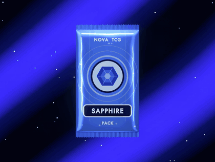

  

  
  
  
  

### 👋 Hi, I'm Sia

Growth and marketing lead for **Web3 and AI** products, with 6 years across token launches, community growth, KOL partnerships and events. Currently **Marketing Manager at [Avatar48](https://avatar48.ai)**, an AI x Web3 companion platform, and Marketing Advisor at [Ordinex](https://ordinex.cc).

I also run hands-on AI image and video production, and use code and AI to build the marketing tools I need.

### 📈 Highlights

<table>
  <tr>
    <td align="center" width="25%"><h3>200K+</h3>community members managed across Avatar48, MC² Finance, Desig and Sentre</td>
    <td align="center" width="25%"><h3>1K → 14K</h3>Avatar48 followers on X, plus Telegram 2K → 14.5K</td>
    <td align="center" width="25%"><h3>2,000+</h3>registrations at Solana Vietnam Coding Camp, season 2</td>
    <td align="center" width="25%"><h3>30+</h3>KOLs managed, and onboarded celebrity Eimi Fukada as AI twin</td>
  </tr>
</table>

### 💼 Experience

| When | Role |
|---|---|
| 2025 - now | **Marketing Manager**, Avatar48 · $AYA launch on Virtuals Protocol, celebrity and KOL partnerships, AI content production |
| 2026 - now | **Marketing Advisor**, Ordinex · market research, positioning and launch plan for cross-border e-commerce |
| 2024 - 2025 | **Marketing Lead**, MC² Finance · weekly newsletter (50%+ open rate), DeFi livestream series, TikTok from zero |
| 2021 - 2024 | **Senior Marketing Executive → Marketing Lead**, Descartes Network · Sentre Protocol IDO, Desig Wallet, Solana Vietnam Coding Camp |
| 2020 - 2021 | **Marketing Executive**, Fahasa · CRM, push and campaign landing pages |

### 🧰 Toolbox

**Marketing** &nbsp;      

**AI image** &nbsp;       

**AI video** &nbsp;       

**Workflow** &nbsp;        

### 🛠️ Featured project

<table>
  <tr>
    <td width="45%"></td>
    <td>
      <h4><a href="https://github.com/Lynn1701/pack-animation-blender">pack-animation-blender</a></h4>
      A procedural 3D booster-pack teaser for NFT listings on Magic Eden, built from code and rendered headless with Blender + Python.  
       
    </td>
  </tr>
</table>

See the full story, case studies and press on <a href="https://linhtran-sia.vercel.app">my portfolio</a>.

